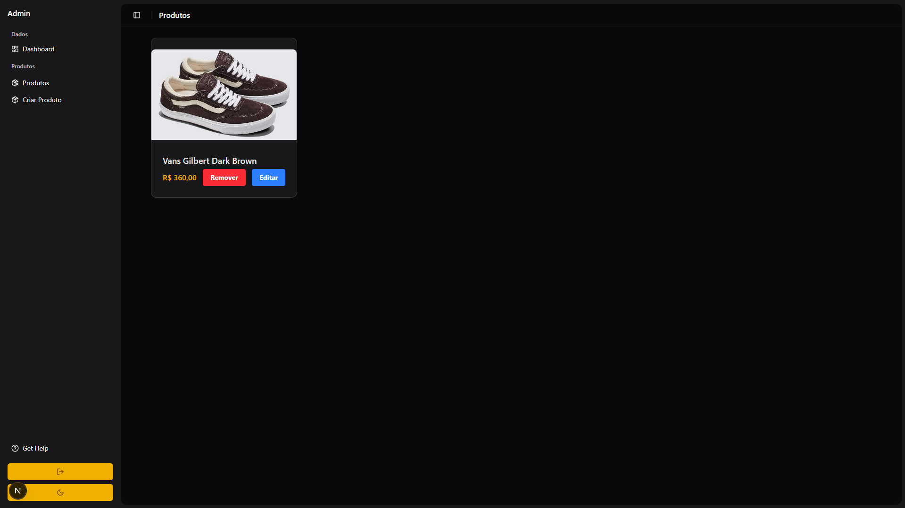
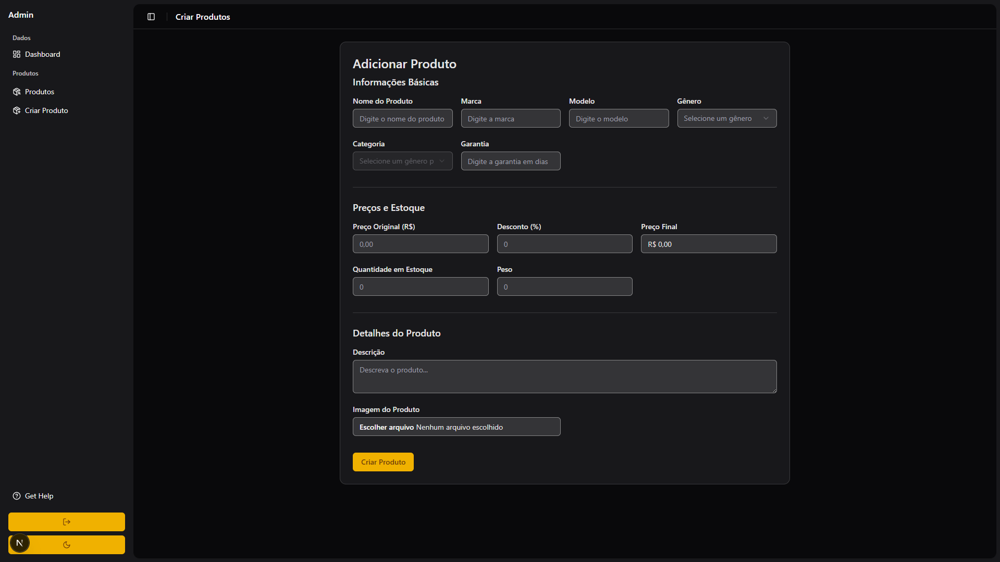

# 🛍️ Sistema de Administração de Loja

Um sistema completo de administração para e-commerce desenvolvido com Next.js no frontend e Nest.js no backend, oferecendo uma interface moderna e intuitiva para gerenciamento de produtos com API robusta e typesafe.

> 🔗 **Integração:** Este sistema de administração está integrado com o [Projeto Loja Marketplace](https://github.com/MatheusPesarini/projeto-loja), fornecendo o backend e painel administrativo para gerenciar os produtos exibidos na loja.

## 📸 Demonstração




## ✨ Funcionalidades

- 📦 **Gerenciamento Completo de Produtos**
  - Criação de novos produtos com formulário detalhado
  - Edição de produtos existentes
  - Exclusão de produtos
  - Upload de imagens de produtos
  - Categorização por gênero e categoria

- 💰 **Sistema de Preços Inteligente**
  - Preço original e sistema de descontos
  - Cálculo automático do preço final
  - Controle de percentual de desconto (0-100%)

- 📊 **Controle de Estoque**
  - Quantidade em estoque
  - Peso dos produtos
  - Garantia em dias

- 🎨 **Interface Moderna**
  - Design responsivo com Tailwind CSS
  - Componentes reutilizáveis com shadcn/ui
  - Modais para edição e criação
  - Sistema de validação com feedback visual

- 🔍 **Validação de Dados**
  - Validação client-side e server-side
  - Mensagens de erro contextuais
  - Estados de loading durante operações

- 🔐 **API Robusta**
  - Backend em Nest.js com TypeScript
  - ORM Drizzle para queries typesafe
  - Validação de dados com pipes
  - Arquitetura modular e escalável

- 🔄 **Integração com Marketplace**
  - API compartilhada entre admin e loja
  - Sincronização automática de produtos
  - Dados consistentes entre sistemas

## 🚀 Tecnologias Utilizadas

### Frontend
- **Framework:** Next.js 14 (App Router)
- **Linguagem:** TypeScript
- **Estilização:** Tailwind CSS
- **Componentes UI:** shadcn/ui
- **Validação:** Zod
- **Gerenciamento de Estado:** React Server Actions
- **Formulários:** useActionState hook

### Backend
- **Framework:** Nest.js
- **Linguagem:** TypeScript
- **ORM:** Drizzle ORM
- **Banco de Dados:** PostgreSQL/MySQL/SQLite
- **Validação:** class-validator
- **Documentação:** Swagger/OpenAPI

## 📋 Pré-requisitos

- Node.js 20.0 ou superior
- npm, yarn, pnpm ou bun
- Banco de dados (PostgreSQL/MySQL/SQLite)

## ⚙️ Instalação

### Frontend

1. Clone o repositório:
```bash
git clone https://github.com/seu-usuario/projeto-loja-admin.git
cd projeto-loja-admin/frontend-next-loja-admin
```

2. Instale as dependências:
```bash
npm install
# ou
yarn install
# ou
pnpm install
# ou
bun install
```

3. Configure as variáveis de ambiente:
```bash
cp .env.example .env.local
# Configure a URL da API do backend
```

4. Inicie o servidor de desenvolvimento:
```bash
npm run dev
# ou
yarn dev
# ou
pnpm dev
# ou
bun dev
```

### Backend

1. Navegue para o diretório do backend:
```bash
cd ../backend-nest-loja-admin
```

2. Instale as dependências:
```bash
npm install
```

3. Configure as variáveis de ambiente:
```bash
cp .env.example .env
# Configure a conexão com o banco de dados
```

4. Execute as migrações do banco:
```bash
npm run db:generate
npm run db:migrate
```

5. Inicie o servidor:
```bash
npm run start:dev
```

6. Acesse a documentação da API em [http://localhost:3001/api](http://localhost:3001/api)

## 📝 Funcionalidades Detalhadas

### Gerenciamento de Produtos

- **Criação:** Formulário completo com validação para novos produtos
- **Edição:** Modal com todos os campos editáveis e valores pré-preenchidos
- **Exclusão:** Remoção segura com confirmação
- **Campos disponíveis:**
  - Nome do produto
  - Marca e modelo
  - Gênero e categoria (seleção dependente)
  - Garantia em dias
  - Preço original e desconto
  - Quantidade em estoque
  - Peso
  - Descrição detalhada
  - Upload de imagem

### Sistema de Categorização

- Gêneros disponíveis: Masculino, Feminino, Unissex, Infantil
- Categorias dinâmicas baseadas no gênero selecionado
- Sistema de validação para garantir consistência

### API Backend

- **RESTful API** com Nest.js
- **Queries typesafe** com Drizzle ORM
- **Validação robusta** com DTOs e pipes
- **Documentação automática** com Swagger
- **Tratamento de erros** centralizado
- **Middleware de validação** para todas as rotas

### Validação e UX

- Validação em tempo real com feedback visual
- Estados de loading durante operações
- Mensagens de erro específicas por campo
- Interface responsiva para diferentes tamanhos de tela
- Sincronização automática entre frontend e backend

## 🔌 Endpoints da API

- `GET /products` - Listar todos os produtos
- `GET /products/:id` - Buscar produto por ID
- `POST /products` - Criar novo produto
- `PATCH /products/:id` - Atualizar produto
- `DELETE /products/:id` - Deletar produto

## 🔗 Projetos Relacionados

Este sistema de administração faz parte de um ecossistema completo de e-commerce:

- 🏪 **[Projeto Loja Marketplace](https://github.com/MatheusPesarini/projeto-loja)** - Interface de loja para clientes finais
- 🛠️ **Projeto Loja Admin** (este repositório) - Painel administrativo para gerenciamento

### Como os projetos se relacionam:

1. **Backend Compartilhado:** O backend Nest.js deste projeto serve dados para ambas as aplicações
2. **Banco de Dados Unificado:** Os produtos gerenciados aqui aparecem automaticamente na loja
3. **API Consistente:** Mesma estrutura de dados e endpoints para ambos os frontends

## 👨‍💻 Autor

**Matheus Pesarini**
- GitHub: [@MatheusPesarini](https://github.com/MatheusPesarini)
- LinkedIn: [Matheus Pesarini](https://linkedin.com/in/matheus-pesarini)

## 🔗 Links Úteis

### Frontend
- [Next.js Documentation](https://nextjs.org/docs)
- [Tailwind CSS](https://tailwindcss.com)
- [shadcn/ui](https://ui.shadcn.com)
- [TypeScript](https://www.typescriptlang.org)

### Backend
- [Nest.js Documentation](https://docs.nestjs.com)
- [Drizzle ORM](https://orm.drizzle.team)
- [class-validator](https://github.com/typestack/class-validator)
- [Swagger](https://swagger.io)

### Projetos Relacionados
- [Projeto Loja Marketplace](https://github.com/MatheusPesarini/projeto-loja)

---

⌨️ Desenvolvido com ❤️ usando Next.js, Nest.js, TypeScript e Drizzle ORM